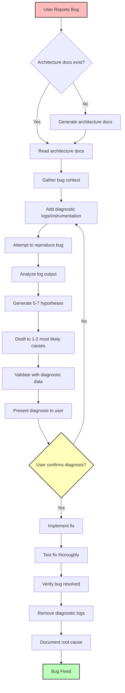

# Bugfix

## Agent Delegation
You MUST delegate complex root-cause analysis and debugging of unfamiliar patterns to the `principal-engineer` sub-agent. For deep codebase investigation, utilize the `codebase_investigator`.

## When to Use

- Production bug reports where root cause is unclear
- Intermittent failures that are hard to reproduce
- Complex multi-layer bugs spanning database, service, API, and UI
- Any bug where initial fix attempts have failed
- Situations requiring careful diagnosis before action

## Workflow Overview



## Phase Summary

| Phase | Name | Time | Description |
|-------|------|------|-------------|
| 1 | Context Gathering | 5-10 min | Read architecture docs, gather bug context |
| 2 | Diagnostic Instrumentation | 10-15 min | Add targeted logging across affected layers |
| 3 | Reproduce & Analyze | 10-15 min | Reproduce bug, collect and analyze diagnostic data |
| 4 | Hypothesis Generation | 10-15 min | Generate 5-7 hypotheses, distill to 1-2 most likely |
| 5 | User Confirmation | MANDATORY | Present diagnosis, wait for explicit approval |
| 6 | Implement Fix | Variable | Fix code, add tests (ONLY after confirmation) |
| 7 | Testing & Verification | 10-15 min | Verify fix, run test suite, check for regressions |
| 8 | Documentation | 10 min | Document root cause and resolution |

See `references/bugfix-phases.md` for detailed phase instructions.

## Key Principles

1. **Diagnostic-First**: ALWAYS add instrumentation before attempting fixes
2. **Hypothesis-Driven**: Generate multiple theories, validate with data
3. **User Confirmation**: NEVER implement fix without explicit approval
4. **Architecture-Aware**: Use architecture documentation for deep context
5. **Evidence-Based**: All conclusions must be backed by diagnostic data
6. **Thorough Testing**: Comprehensive tests for fix and edge cases
7. **Clean Cleanup**: Remove ALL temporary diagnostic code after fix

## Constraints

- **SMART BRANCHING** — Before creating a branch, check the ticket's lineage.
    *   If this is a sub-task (child of a Story/Feature), check if a branch for the **Parent Ticket** already exists. If so, switch to it. If not, create the branch using the **Parent Ticket's ID**.
    *   If this is a Feature/Story (child of Epic) or Standalone, create/use a branch for **This Ticket**.
    *   **Naming Convention**: `fix/<anchor-ticket-id>-<short-desc>`
- **STOP at Phase 5** and wait for user confirmation before implementing any fix
- **Remove ALL diagnostic instrumentation** after fix is verified
- **Generate 5-7 hypotheses** before distilling to most likely causes
- **Document root cause** and prevention strategy in resolution document
- **Never guess** - if diagnostic data is insufficient, add more instrumentation

## Templates

- `references/templates/context.md` - Bug context documentation
- `references/templates/diagnostic-logs.md` - Diagnostic log format
- `references/templates/diagnosis-report.md` - Diagnosis presentation to user
- `references/templates/resolution.md` - Bug resolution documentation

## Example

```
Bug Diagnosis: Null Pointer in User Service

Architecture Check:
- Read /docs/architecture/data-model.md
- Identified User entity and relationships
- Found service layer patterns

Phase 1: Adding Diagnostics
- Added 8 diagnostic log points
- Added error boundaries
- Added state tracking

Phase 2: Reproduction
- Bug reproduced (100% success rate)
- Diagnostic data collected
- Timeline: Error at T+45ms

Phase 3: Hypothesis Generation

Generated 5 hypotheses:
1. Missing eager loading (HIGH)
2. Null validation missing (MEDIUM)
3. Race condition (MEDIUM)
4. Cache issue (LOW)
5. Permission issue (LOW)

Distilled to:
PRIMARY: Missing eager loading (90% confidence)
SECONDARY: Null validation (10% confidence)

Diagnosis Report:
┌─────────────────────────────────────────┐
│ Root Cause: Missing Eager Loading       │
│                                         │
│ User.subscription relationship not      │
│ loaded by default. Service expects      │
│ it to exist, causing undefined error.   │
│                                         │
│ Fix: Add include: { subscription: true} │
│ to UserRepository.findById()            │
└─────────────────────────────────────────┘

Does this diagnosis match your understanding?
[Waiting for user confirmation...]

User confirmed diagnosis

Implementing Fix:
- Updated UserRepository.findById()
- Added defensive null check
- Added relationship loading tests
- All tests passing (47/47)

Cleanup:
- Removed 8 diagnostic log points
- Restored original error handling

Documentation:
- Updated data-model.md with pattern
- Created resolution document

Bug Fixed!
```

Begin by gathering context about the reported bug and checking for architecture documentation.
